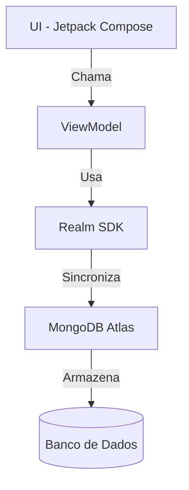

## 📱 O que é o App Excelsior Store?

Um aplicativo Android que:

- Mostra uma lista de produtos com seus preços

- Pode adicionar/remover itens

- Armazena os dados no MongoDB (banco de dados na nuvem)

- Funciona offline e sincroniza quando há internet (se usar Realm)


## 🧩 O que é Realm?

- É um "atalho mágico" para usar MongoDB em apps móveis:

- Banco de dados local: Armazena dados no celular (funciona offline)

- Sincronização automática: Quando o celular tem internet, atualiza o banco na nuvem

- Feito pelo MongoDB: É a solução oficial para dispositivos móveis


## 👉 Comparação:

- Sem Realm: App → API → MongoDB (você precisa criar o backend)

- Com Realm: App → MongoDB direto (mas de forma segura)


## 🔄 Como os Dados Fluem

1. Tela → Pede dados para o ViewModel

2. ViewModel → Pede dados para o Realm

3. Realm → Busca no MongoDB (nuvem ou local)

4. Resposta → Volta para a tela e mostra os produtos

**RESUMO VISUAL**:

```
[INTERFACE] (Jetpack Compose)  
    ↓ ↑  
[VIEWMODEL] (Lógica)  
    ↓ ↑  
[REALM] (Conexão com MongoDB)  
    ↓ ↑  
[MONGODB ATLAS] (Banco na nuvem)
```

⚠ Por que não conectar direto ao MongoDB sem Realm?

**Problema**: Colocar a senha do banco no app é como deixar a chave de casa debaixo do tapete

**Solução Realm**: Ele usa autenticação segura e gerencia a conexão por você


## 🏗 Estrutura do Projeto (Partes Principais)
**MongoDB.kt** (Configuração)

"Manual de instruções" para conectar ao banco de dados

Exemplo:

```kotlin
// Configura como o app se conecta ao MongoDB
RealmConfiguration.Builder(schema = setOf(Produto::class)).build()
```

**Produto.kt** (Modelo de Dados)

Define como um produto é armazenado:

```kotlin
class Produto : RealmObject {
    @PrimaryKey var _id: ObjectId = ObjectId()
    var nome: String = ""
    var preco: Double = 0.0
}
```

**MainViewModel.kt** (Lógica)

Faz as operações no banco de dados: 

```kotlin
fun loadProdutos() { /* Busca produtos */ }
fun addProduto() { /* Adiciona novo */ }
fun deleteProduto() { /* Remove */ }
```

**MainScreen.kt** (Tela - Jetpack Compose)

Mostra os itens em uma lista rolável:

```kotlin
LazyColumn {
    items(produtos) { produto ->
        Text(produto.nome)
        Text("R$ ${produto.preco}")
    }
}
```

### 📁 Estrutura do Projeto (Detalhada)



## 🗂️ Arquitetura de Pastas

app/
├── src/
│ ├── main/
│ │ ├── kotlin+java/ # Código Kotlin e Java
│ │ │ ├── data/
│ │ │ │ ├── MongoDB.kt # Configuração do Realm
│ │ │ │ └── models/
│ │ │ │ └── Produto.kt # Modelo de dados
│ │ │ │
│ │ │ ├── ui/
│ │ │ │ ├── screens/
│ │ │ │ │ └── MainScreen.kt
│ │ │ │ ├── components/
│ │ │ │ │ └── ProdutoItem.kt
│ │ │ │ └── theme/
│ │ │ │
│ │ │ └── viewmodels/
│ │ │ └── MainViewModel.kt
│ │ │
│ │ └── res/ # Recursos Android
│ │ ├── drawable/
│ │ ├── values/
│ │ └── ...
│ │
│ └── debug/ # Configurações de debug
│
├── build.gradle # Dependências principais
└── ...

### 🔄 Fluxo Visual Simplificado (ASCII)

+----------------+ +---------------+ +----------+ +---------------+
| Tela (UI) | <---> | ViewModel | <---> | Realm | <---> | MongoDB Atlas |
+----------------+ +---------------+ +----------+ +---------------+
↑ ↑ ↑
| | |
| Mostra dados | Gerencia lógica | Sincroniza dados
↓ ↓ ↓
[Interação do usuário] [Operações de CRUD] [Banco de dados na nuvem]


### 📌 Legenda

- **`data/`**: Tudo relacionado a dados (modelos, configuração do banco)
- **`ui/`**: Componentes visuais (telas, componentes)
- **`viewmodels/`**: Lógica entre a UI e os dados
- **Fluxo**: Sempre da esquerda (interface) para direita (banco de dados)
- **`build.gradle`**: Dependências do projeto
- **`res/`**: Recursos do Android (imagens, strings, etc.)

## 🔧 Passos para Executar:

- Clone o repositório

- Abra o projeto no Android Studio

- Atualize as dependências no `build.gradle`

- Configure o MongoDB Atlas (crie um cluster e obtenha a URL de conexão)

- Configure o MongoDB Realm (crie um app e obtenha o ID do app): 

    1. Adicione a URL de conexão no arquivo `MongoDB.kt`

    2. Substitua "your-realm-app-id" (dentro do arquivo MongoDB.kt) pelo ID do seu app no MongoDB Realm.

    3. No MongoDB Atlas, habilite a Device Sync e defina as permissões.

    4. Adicione seu IP à whitelist no MongoDB Atlas (Network Access).

- Execute o aplicativo no emulador ou dispositivo Android

- Teste a adição e remoção de produtos

- Verifique a sincronização com o MongoDB Atlas (use o console do MongoDB para ver os dados)


📌 Notas Importantes:

- Para um app real, adicione tratamento de erros.

- Use Hilt para injeção de dependências (recomendado para projetos maiores).

- O Realm requer Kotlin 1.9+.